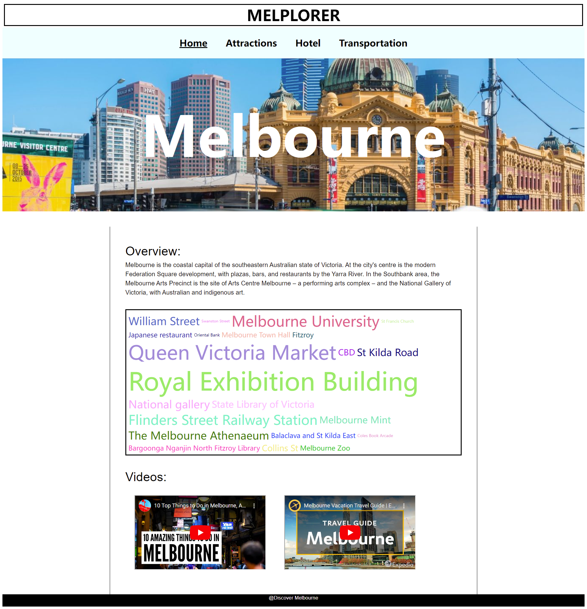

# GEOM90007 Information Visualisation (assmt 3)

This frontend is bootstrapted by react app (need node.js and npm to run on local), and deployed by Heroku


# 2 ways to run the project on website


## 1. Runnug on deployed website

https://melplorer.herokuapp.com/ 

## 2. Runnung on Local host

In the project directory, you can run:
```sh
cd /path/to/project
cd frontend
npm install
npm start
```
and you will be allocated in http://localhost:3000




# File dictionary

| data file name | website page shows              |
| :---------- | :-------------------------- |
| attraction.twbx      | tableau in page /attractions |
| landmark.xlsx      | self collected excel data for tableau in page /attractions |
| IV_analyse_final.Rmd      | png graph made in page /report (direct from page /hotel)    |
| hotel.twbx      | tableau in page /hotel    |
| hotel.xlsx      | self collected excel data for tableau in page /hotel    |
| transportation.twbx      | tableau in page /tansportation   |
| folder Transportation      | data for tableau in page /tansportation   |